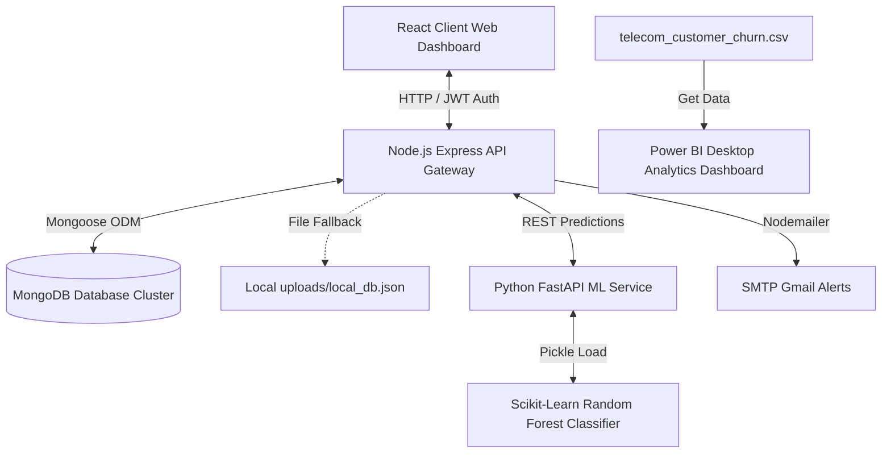

# 🌌 ChurnPredict AI: Customer Churn Prediction & Analytics Platform

[](https://github.com/EGAAJITH-G/Customer-Churn-Prediction-Power-BI-/blob/main/LICENSE)
[](https://react.dev/)
[](https://nodejs.org/)
[](https://fastapi.tiangolo.com/)
[](https://www.mongodb.com/)
[](https://powerbi.microsoft.com/)

**ChurnPredict AI** is a state-of-the-art, full-stack Customer Churn Prediction and analytics ecosystem designed for telecommunication service providers. It combines a **React (Vite) dashboard**, a **Node.js Express API layer**, a **Python FastAPI Machine Learning service**, and an interactive **Power BI Dashboard** to predict, analyze, and mitigate customer churn.

---

## 📸 Dashboards & Application Preview
The platform features **Aurora AI Light Mode**, characterized by a modern glassmorphic, Apple-and-Linear-inspired aesthetic. It includes custom metric cards, user status logs, prediction widgets, and file upload systems.

*Refer to [application_walkthrough.html](file:///d:/Softnova%20company%20project/Customer-Churn-Prediction-Power-BI-/application_walkthrough.html) and [architecture_guide.html](file:///d:/Softnova%20company%20project/Customer-Churn-Prediction-Power-BI-/architecture_guide.html) for detailed pages & layouts.*

---

## 🛠️ Tech Stack & Key Features

### Frontend (React Single Page App)
*   **Modern Framework:** React 18 powered by Vite for instant hot-module replacement.
*   **Rich UI Components:** Clean dashboard views, responsive sidebar, predictive analysis forms, and customer tabular details.
*   **Data Visualization:** Interactive data charts rendered via **Recharts** and vector icons from **Lucide React**.
*   **Global State & Security:** JWT-based user session authentication via React Context API.

### Backend Middleware (Node.js & Express)
*   **REST API Services:** Routes handling customer ingestion, authentication, churn predictions, and dashboard stats.
*   **Robust Ingestion:** CSV batch uploading utilizing **Multer** and automated parsing engines.
*   **Offline Fallback Mode:** In the absence of MongoDB, the server mounts an automated JSON local storage backend (`server/uploads/local_db.json`).
*   **Smart Alerts:** Automated email notifications triggered via **Nodemailer** using custom-designed HTML transaction templates.

### AI & ML Microservice (FastAPI & Python)
*   **Random Forest Classifier:** Trained on synthetic & historical telecom datasets, delivering probabilistic churn risks.
*   **API Framework:** FastAPI endpoint operating on Uvicorn for asynchronous ML predictions.
*   **Fallback Heuristics:** If the Python server is offline, the Node.js backend launches an integrated **rule-based heuristic engine** assessing churn factors (e.g., month-to-month contracts, tenure, payment methods) to ensure 100% system availability.

### Analytics (Power BI)
*   **Interactive Analytics:** Visualizations assessing contract lifespans, internet connection speeds, and billing methods.
*   **Custom DAX Measures:** Complex business KPIs (MRR, Churn Rate, Monthly Revenue Lost, Customer Tenure).

---

## 🏗️ System Architecture



---

## 📂 Repository Structure

```
Customer-Churn-Prediction-Power-BI-/ (Root Workspace)
│
├── application_walkthrough.html     # Client walkthrough & screenshot guide
├── architecture_guide.html          # End-to-end full system documentation
├── runtime.txt                      # Server runtime specification
├── README.md                        # Master documentation (This file)
│
└── telecom-churn-app/               # Application Root Directory
    ├── package.json                 # Monorepo task orchestration configuration
    │
    ├── client/                      # React Frontend (Vite)
    │   ├── src/
    │   │   ├── components/          # Reusable UI (Sidebar, Navbar, Custom Loaders)
    │   │   ├── context/             # JWT-based Auth Context
    │   │   ├── pages/               # Views (Dashboard, Prediction UI, Customer List)
    │   │   ├── index.css            # Custom CSS Variables & Light Theme Setup
    │   │   └── App.jsx              # Routing rules & Protected Route guards
    │
    ├── server/                      # Node.js API Service
    │   ├── config/                  # Mongoose & Local Database Fallback configurations
    │   ├── controllers/             # Express Route controllers (Business logic)
    │   ├── middleware/              # JWT authorization & file import middlewares
    │   ├── models/                  # MongoDB Database structures
    │   ├── uploads/                 # Temporary directories & local JSON storage
    │   ├── utils/                   # Nodemailer functions & heuristic evaluation engines
    │   └── server.js                # Server entry point (Port 5000)
    │
    ├── ml-service/                  # Machine Learning Microservice
    │   ├── dataset/                 # CSV storage for training datasets
    │   ├── saved_model/             # Serialized (.pkl) Random Forest model
    │   ├── train.py                 # Synthetic data generator & model training pipeline
    │   ├── app.py                   # FastAPI REST Prediction Endpoint (Port 8000)
    │   └── requirements.txt         # Python dependencies configuration
    │
    └── powerbi/                     # Power BI Analytics Module
        └── README.md                # DAX syntax reference & chart templates guide
```

---

## 🚀 Installation & Local Launch

### Prerequisites
Make sure you have the following installed on your machine:
*   [Node.js](https://nodejs.org/) (v18 or higher)
*   [Python](https://www.python.org/) (v3.9 or higher)
*   [Power BI Desktop](https://powerbi.microsoft.com/desktop/) (For analyzing dashboards)
*   [MongoDB Community Server](https://www.mongodb.com/try/download/community) *(Optional, handles local file fallback)*

---

### Step 1: Clone the Repository & Monorepo Install
Open your terminal and execute:
```bash
# Clone the repository
git clone https://github.com/EGAAJITH-G/Customer-Churn-Prediction-Power-BI-.git
cd Customer-Churn-Prediction-Power-BI-/telecom-churn-app

# Install all sub-packages (Client & Server)
npm run install-all
```

---

### Step 2: Configure Environment Variables
Create a `.env` file in the `telecom-churn-app/server` directory and define the following variables:
```env
PORT=5000
MONGO_URI=your_mongodb_connection_string
JWT_SECRET=your_super_secure_auth_key
ML_SERVICE_URL=http://localhost:8000
SMTP_HOST=smtp.gmail.com
SMTP_PORT=587
SMTP_SECURE=false
SMTP_MAIL=your_gmail_address@gmail.com
SMTP_PASSWORD=your_gmail_app_password
FROM_NAME="ChurnPredict AI"
```

---

### Step 3: Launch the Services

You need to run the **Backend Server**, **ML Service**, and **React Frontend**.

#### 1. Start the Node.js Express API Server
```bash
cd telecom-churn-app/server
npm start
```
*Note: If MongoDB is offline or unavailable, the console will notify you that it has successfully mounted the local JSON database engine (`uploads/local_db.json`).*

#### 2. Start the FastAPI ML Microservice
```bash
cd telecom-churn-app/ml-service
# Install Python packages
pip install -r requirements.txt

# Run model trainer
python train.py

# Launch FastAPI web app
python app.py
```
*Note: The FastAPI server runs on `http://127.0.0.1:8000`. If offline, the Node.js server gracefully activates the smart heuristic fallback predictor.*

#### 3. Start the React Frontend Web Application
```bash
cd telecom-churn-app/client
npm run dev
```
Open [http://localhost:5173](http://localhost:5173) in your web browser.

---

## 🧮 Power BI Dashboard & Custom DAX Metrics
To load the visualizations, open **Power BI Desktop**, connect to `telecom-churn-app/dataset/telecom_customer_churn.csv`, and create the following business metrics:

### 1. Total Customers
```dax
Total Customers = COUNT(telecom_customer_churn[customerId])
```

### 2. Churn Rate (%)
```dax
Churn Rate % = 
VAR Churned = CALCULATE(COUNT(telecom_customer_churn[customerId]), telecom_customer_churn[churn] = "Yes")
VAR Total = [Total Customers]
RETURN DIVIDE(Churned, Total, 0) * 100
```

### 3. Monthly Recurring Revenue (MRR)
```dax
MRR = SUM(telecom_customer_churn[monthlyCharges])
```

### 4. Monthly Revenue Lost (to Churn)
```dax
Monthly Revenue Lost = CALCULATE(
    SUM(telecom_customer_churn[monthlyCharges]), 
    telecom_customer_churn[churn] = "Yes"
)
```

*For step-by-step design details, check the [Power BI Guide](file:///d:/Softnova%20company%20project/Customer-Churn-Prediction-Power-BI-/telecom-churn-app/powerbi/README.md).*

---

## 🛡️ License
Distributed under the ISC License. See `LICENSE` for more information.

---

## 👥 Authors & Contributors
*   **Ajith** - Developer & Analytics Engineer ([GitHub Profile](https://github.com/EGAAJITH-G))
